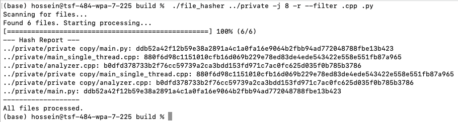

# Parallel File Hasher

**A high-performance C++ command-line utility for calculating SHA256 hashes of files across an entire directory tree.**

This tool is built with modern C++ (C++17) and leverages a custom thread pool to achieve significant performance gains on multi-core systems. It serves as a practical demonstration of advanced concurrency concepts and robust software design.


## Features
- 🚀 **High-Performance Hashing:** Uses a thread pool to process multiple files in parallel.
- 📁 **Recursive Traversal:** Scan a single directory or an entire directory tree with the `-r` flag.
- 🧪 **Extension Filtering:** Easily process only specific file types (e.g., `.cpp`, `.jpg`) with the `--filter` option.
- 📊 **Dynamic Progress Bar:** A clean, real-time progress bar provides an excellent user experience.
- 🧾 **Flexible Output:** Print hash reports to the console or save them directly to a file with the `-o` flag.
- 🧩 **Modular Design:** The thread pool logic is encapsulated in a reusable class, separating it from the main application logic.

## Build Requirements
- A C++ compiler with **C++17** support (e.g., GCC 7+, Clang 5+, MSVC 2017+).
- **CMake** (version 3.16 or higher).

## How to Build
1. **Clone the repository:**
   ```bash
   git clone <your-repository-url>
   cd ParallelFileHasher
   ```

2. **Configure and build with CMake:**
   ```bash
   mkdir build
   cd build
   cmake ..
   make
   ```

3. The executable, `file_hasher`, will be located in the `build` directory.

---

## Usage
Run the program from the command line, with the path to a directory as the first argument, followed by optional flags.

**Syntax**
```bash
./file_hasher <directory_path> [options]
```

### Options
| Flag | Description |
|---|---|
| `-j <threads>` | Set the number of worker threads. Defaults to hardware concurrency. |
| `-r`, `--recursive` | Scan directories recursively. |
| `--filter <exts>` | Filter for files with specific extensions (e.g., `--filter .cpp .h`). |
| `-o <file>` | Write the final hash report to a specified file instead of the console. |

### Examples
- **Scan a directory using the optimal number of threads:**
  ```bash
  ./file_hasher ~/Documents/Photos
  ```

- **Recursively scan a project and save the hashes of `.cpp` and `.h` files to a log:**
  ```bash
  ./file_hasher ~/Projects/MyProject -r --filter .cpp .h -o hashes.log
  ```

- **Scan a directory using exactly 4 threads:**
  ```bash
  ./file_hasher /mnt/data -j 4
  ```

---

## C++ Concepts Demonstrated
This project was built as an exercise in modern C++ and showcases several key concepts:

- **Concurrency:** `std::thread`, `std::mutex`, `std::condition_variable`, and `std::atomic`.
- **Object-Oriented Design:** Encapsulation of the thread pool into a reusable `ThreadPool` class.
- **C++17 Features:** `std::filesystem` for cross-platform directory and file manipulation.
- **RAII (Resource Acquisition Is Initialization):** Use of `std::lock_guard` and `std::unique_lock` for safe mutex handling.
- **Functional Programming:** Use of `std::function` and lambdas for creating generic, enqueueable tasks.

---

## License
This project is licensed under the MIT License. See the `LICENSE` file for details.

---

## Screenshot
